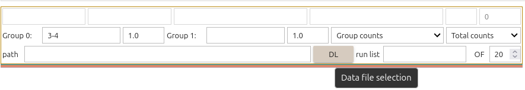
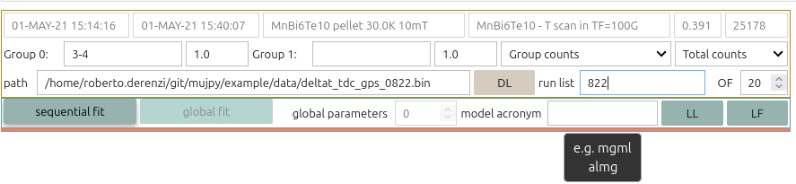
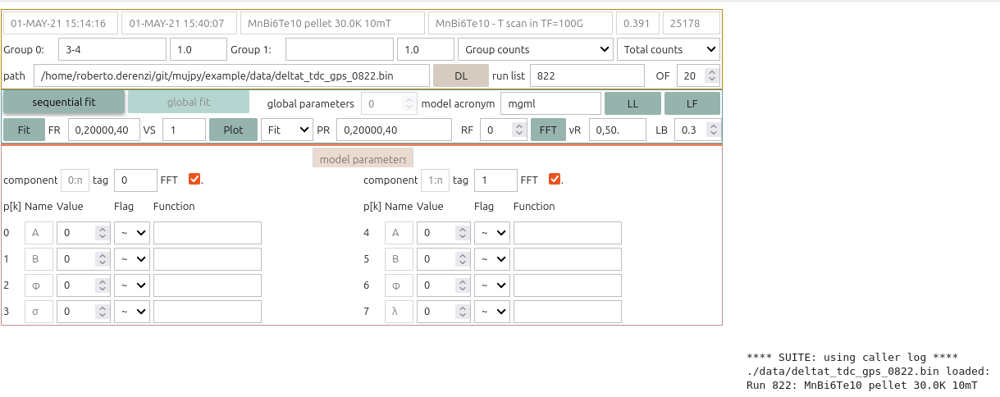

.. |mSR| replace:: :math:`\mu`\ SR
.. |a| replace:: :math:`\alpha`

Introduction
============
Welcome to **mujpy**  |mSR| data analysis, v.3.0, a small set of command-line python classes. Basic code-oriented |mSR| concepts are recalled in :doc:`NutsNdBoltsMuSR`.
These classes provide 
        * simultaneous access to sets of asymmetries on the same sample: list of runs and/or list of detector groups.
        * Minuit fit of muon asymmetries from PSI and ISIS (add your own)
        * intuitive GUI model editor, for simple single dataset fit and more complex global fits of many datasets and detector groups
        * a fit display based on animations, optional distinct packing of early and late times, to show fast and slow evolution.    
        * logs and csv output for plotting of fit parameters
        * reproducible by saved json fit input

mujpy merges the best of `musrfit <http://lmu.web.psi.ch/musrfit/technical/main.html>`_ by Andreas Suter, the *steep learning curve* standard, with the old intuitive `mulab <http://www.fis.unipr.it/~derenzi/dispense/pmwiki.php?n=MuSR.Mulab>`_\ (Matlab) approach by R. De Renzi. The main virtue of the latter were

    * elementary fit components, labelled by two letters: damped cosines (``mg``, ``ml``), Bessel functions (``jg``, ``js``), simple relaxations (``bg``, ``bl``), Kubo-Toyabe functions (``kg``, ``kl``), FMuF functions (``fm``), etc. 
    * model selected  by acronym, combining the two-letter components: ``mgml`` is the sum of a Gaussian- and a Lorentzian-damped cosine.
    * GUI model editor for combining parameters among components, based on jupyter notebooks interface and `ipywidgets <https://ipywidgets.readthedocs.io/en/latest/>`_  
    * plot with residues to visualize goodness of fit 


.. sidebar:: Global fit

   A global fit is the minimization of a single cost function, the sum of a cost function for each asymmetry. 

Eight types of fit are conventionally labelled *A1, A20, A21, B1, B20, B21, C1, C2*. *A* fits are single run, *B* are sequential fits on a set of asymmetries, *C1* is a **global** fit of a set of runs. *X20* (with *X* = *A,B*\ ) are sequential fits on two or more detector groups (e.g. 2-1 and 3-4 on PSI GPS). *X21* are simultaneous **global** fits of the same groups.
Finally *C2* is a global fit across runs and groups.  

This nomenclature is only relevant inside the code, the GUI just selects sequential or global fits.
Global parameters are defined in advance. The simplest *A21* global fit assigns them to model parameters. 
In *C1, C2* fits virtual *hash* parameters are also defined in advance, assigned to model parameters, and give rise to a separate local replica for each asymmetry. 

.. note:: Each of these eight fit types comes in two versions: one, say ``mgml``, with fixed values of the |a| ratio that defines a detector grouping asymmetry, and one with the |a| values as Minuit fit parameters, for automatic calibration when the data allow it. The acronym of the second version must be ``almgml``, the |a| parameter being formally treated as the first fit component ``al``, although it is not an additive one. 

The package includes a ```test.py``` script demonstrating all these 16 subtypes on a standard TF |mSR| data set (a temperature scan approaching a magnetic transition from the paramagnetic side). Try it! Just run ```python test.py``` from subfolder ```example```. Each script in the sequence can be run independently and used as templates for the corresponding fit type.

Basic GUI editor usage
----------------------

Using the ```.py``` templates is efficient but has one big drawback: the fit is defined in its json file, automatically stored in the ``fit`` subfolder. It is pretty transparent, but its modification is very error prone. Furthermore, the logic of a global fit is not so easy to plan when concentrating on the json syntax. The solution is the mudashed gui class, to be invoked inside a jupyter notebook. The command sequence is straightforward. If you already installed python, mujpy and jupyter lab, choose your project folder, download the data in subfolder ```data```, launch jupyter lab, launch a new empty notebook andtype 

.. code-block::

    %matplotlib qt

in the first cell to activate the correct graphic backend. Then type

.. code-block::

        from mujpy.mudashed import dashed as mudash
        the_dash = mudash()
  
In the second cell (this is actually the content of Mudashed.ipynb, just start that one if you are lazy). Three rows of widgets appear 



For a single run, single grouping fit, check that Group 0 is OK and press DL to select your data file. Type the run number (no leading zeros) in the run list box and press Enter. A new row o widgets appears. Run title and other info have now appeared in the fist two widget rows. 



Type your chosen model acronym in the box, e.g. ```mgml``` and press ```Enter```. The model editor appears. 



Just select reasonable guess values and press fit to see a minimization.

If you are a |mSR| beginner refer to a muon primer, such as [Blundell]_, also at `arXiv <https://arxiv.org/abs/cond-mat/0207699>`_ or to a textbook, like [BDLP]_, [Yaouanc]_ or [Amato]_ for this purpose.

You will find more detailed description of the different mujpy methods in the :ref:`reference`. 
Caution: tutorial for v. 3.0 is *work-in-progress*, together with :ref:`Reference`. 

References
----------

.. [BDLP] S.J. Blundell, R. De Renzi, T. Lancaster and F. Pratt, 
   Muon spin spectroscopy, OUP 2021
.. [Blundell] S.J. Blundell, 
   Contemporary Physics 40, 175-192 (1999)
.. [Yaouanc] A. Yaouanc, P. Dalmas De Reotier, 
   Muon spin rotation relaxation and resonance, Oxford University Press, 2011
.. [Amato] A. Amato, E. Morenzoni, 
   Introduction to muon spin spectroscopy, Springer, 2024

