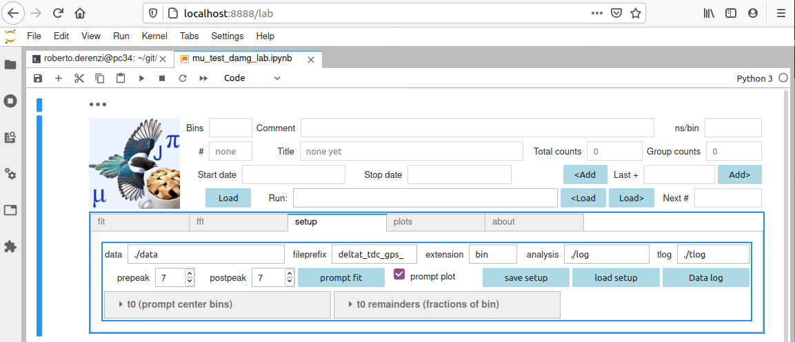
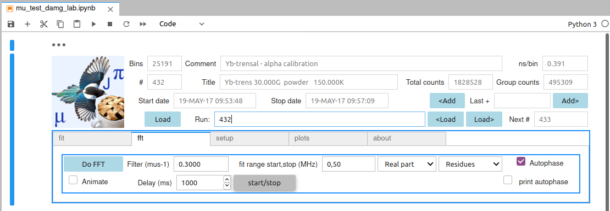
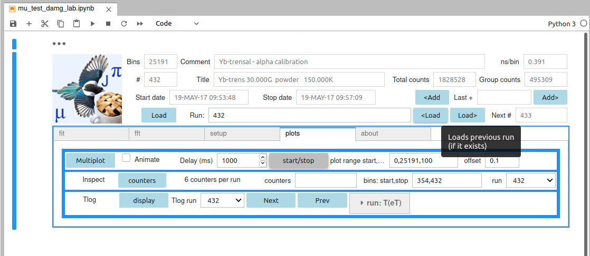
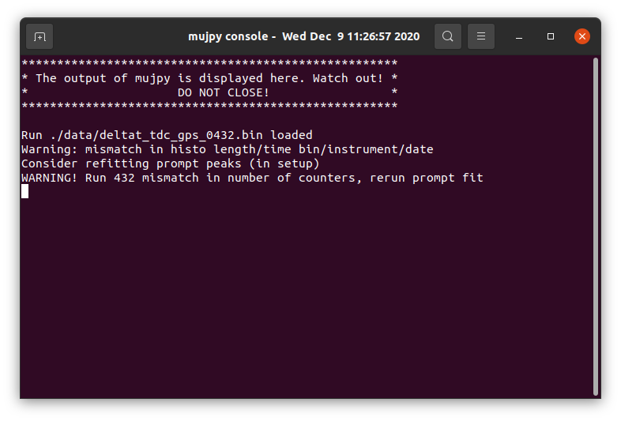
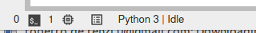
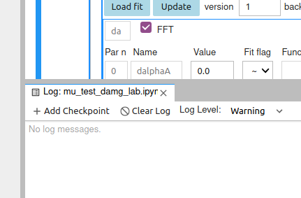

.. _reference:

+++++++++
Reference
+++++++++

This is the mujpy Reference Manual v. 1.00 (in its transition to v. 1.05)

------
Header
------
The top part of the mujpy gui contains a logo together with the information on the loaded run (in `single run mode`_) or the master loaded run (in the `suite`_ mode). The information contains the run number, the run title, the total conuts, the total counts over the selected `grouping`_ of detectors.
The 1.05 version contains the loaders: load button for GUI file selection, next, previous, add buttons and the speedload text bar: legal syntax in the folloring examples
* *Run[run suite]* is a Text area where single run numbers can be written. The data file is loaded upon hitting return

suites
------
* more complex syntax allows storing *suites* of runs, with combination of *,:+* (only one : allowed)

 * ``432,433`` loads the *suite* of runs 432, 433
 * ``432:434`` loads the *suite* of runs 432, 433, 434
 * ``432,433, 435:437`` loads the *suite* of runs 432, 433, 435, 436, 437
 * ``432+433`` loads the sum of these two runs as a single run, etc.
 
If a *single* run is loaded 

* *Next run* displays the next run number, if the file exists
* *Load nxt* loads it
* *Load prv* loads the previous, if it exists
* *Add nxt* adds next run
* *Add prv* adds the previous, if it exists

If a suite is loaded the buttons refer to the first run in the suite

----
Tabs
----
The lower part of the gui is divided in tabs:  `fit`_,  `fft`_, `setup`_, `plots`_, `about`_.
Click on the tab to see its content and methods, activated by widget controls (buttons, checkboxes, input text field, etc.) [`output`_ tab is added as a fallback for the terminal output

-----
setup
-----
The setup tab contains preliminary information and fields in three boxes. 



The first row contains paths  

* the data path (the folder where the data files are stored), 
* the temperature log, tlog, path (optional), 
* the analysis path (the folder where log files will be saved). 

in the center the two strings that compose the data file name, e.g. for stardard filename ``deltat_tdc_gps_0432.bin``

* *fileprefix* is ``deltat_tdc_gps_``
* *extension* is `bin`

The working directory (wd), i.e. the path from which the jupyter notebook is lauched is saved automatically. 

The second row is related to the :math:`t_0=0` bin iminuit fit, minimizing the :math:`\chi^2` of the initial data slice and the best fit function  `muprompt`_.

* *prepeak*  and *postpeak* are the peak interval span (the number of bins) respectively before and after the maximum;
* the *prompt fit* button launches iminuit
* the *prompt plot* checkbox to produce a plot; 
* the *save setup* and *load setup* buttons save and load a setup file that stores the setup information in/from the  ``mujpy_setup.pkl`` file
* the *Data log* button produces a text file listing of all data files in the data directory::
   run #     T1(eT1)     T2(eT2)     Mev     Start     datetime     title
* click on the *t0 bins and remainders* and *Total counnte* accordions to show individual counter values

muprompt
--------

.. math::

     \frac {A_1} {\sqrt{2\pi\sigma}}  \exp\left[-\frac 1 2 \left(\frac{t-t_0} \sigma\right)^2\right] + A_0 +\frac {A_2} 2 \left[1+\mathrm{erf} \left(\frac{t-t_0} {\sqrt 2 \sigma}\right)\right]


single run mode
---------------
Individual data set are fitted to models

suite mode
----------
Individual data set are fitted to the model (defined in `fit`_) in sequence, according to the loaded run suite.

---
fit
---
The fit tab selects the 

fit model 
---------
and its parameters. Any model is made of predefined additive components, named by two letter codes (see ``Component list``_) and the model naming scheme is based on this feature. A model made of, say, 3 components, *ab*, *ab* and *de* will be called *ababde* (or any other permutation of the three components) 

.. image:: daml.png

The top frame selects the model and conditions, namely

.. _grouping:

grouping
--------
the set of conters that form the Forward and Backward detectors, and

alpha
-----
the ratio of count rates :math:`N_f/N_b` between initial (unpolarized) count rates for Backward and Forward grouping. Other functionalities of the top box are

* *Fit* button launches iminuit migrad minimization of the model.
* *Load fit* button opens a GUI file selection of available (past) ``pkl`` fit files containing fit results. Loading one such file  reproduces the input for obtaining again the same fit.
* *Update* button, to transfer best fit values to parameter guess values.
* *version* Text, distinguishes fits of the same model, to allow for different parameter relations (fixed/variable/global/functions).
* *model* Text area, to define new model: e.g. ```mgmgbl`` is a three component model,  ``mg``, ``mg``, ``bl``.
* *forward*, *backward* text area define the grouping, defining groups of counters according to the following syntax

* ``2,3`` or ``2:3`` means that counters 2,3 are grouped together
* ``1:5, 10, 15:19`` means that counters 1,2,3,4,5,10,15,16,17,18,19 are grouped together
* *alpha* Float Text input, see above
* *offset* is the first good bin, counting from the center prompt peak  (*start* = k means that the fit starts from  bin *offset* + k).

* *fit range* has a *start, stop* and a *start,stop,pack* options, to define the interval and packing for the fdata minimization. 
* *plot range* with more options

* *start, stop* to plot data between *start* and *stop* bin, with no rebinning
* *start,stop,pack* to plot data between *start* and *stop* bin, rebinned by factor *pack*
* *start,stop,late,pack* to plot ata in two successive ranges, between *start* and *stop* bin, with no rebinning, between *stop* and *last*  bin, rebinned by factor *pack*
* *start,stop,packe,late,packl* to plot data in two successive ranges, between *start* and *stop*,  rebinned by factor *packe*, between *stop* and *last* rebinned by factor *packl*
* see also `graphic zoom`_
* *Guess* checkbox, for ploting initial conditions instead of fit results.

* *Plot* button, produces a plot with either best fit or guess values.

* *Animate* checkbutton, if selected the suite of runs is plotted as frames of an animation, if unselected they are tiled with an offset in a single multirun plot.
* *Delay* between frames [ms].  

Fit Dashboard
-------------
 
The lower frame contains the fit components selected either by the *model* syntax or by loding a saved fit. The frame is divided in components boxes, whose first line is the component label and the :ref:`FFT-checKbox`. The other lines list their parameters, each indentified by an index, a unique name, a Text area for the starting guess value, a symbol:

 - *~*    free minuit parameter, 
 - *!*    fixed parameter 
 - *=*    the function text area on the right is activated. You can input symple expressions, such as ``p[1]``, implying that the present parameter and parameter 1 share the same value. For instance two *ml* components in model *damlml* could share their phase parameters. Slightly more complex functions may be written, such as ``p[2]-p[3]``, or ``p[0]*exp(p[2]/p[3])``, etc.

* parameter names are automatically generated and pretty obvious if you are not new to MuSR. E.g. *ml* has a (partial) *asymmetry*, a *field* value (in Tesla), a *phase* (in degrees) and a Lorentzian relaxation *Lor_rate* (in inverse microseconds); 
* names are followed by a capital letter that uniquely identifies each component (e.g. in a *blmlml* fit the asymmetries of the three components would be *asymmetryA*, *asymmetryB*, *asymmetryC*, respectively) 

At the bottom left or right (depending on space) a *Show parameter plots* appears, with two buttons.
You must have performed at least one fit with the chosen model (displayed by the ``Fit Dashboard``_ ). Say that you have done this for a few runs, at increasing T (perhaps as a *suite fit*). This has produced a log file (daml.1.2-1.csv, in the present example). You can now display its five parameters vs temperature by selecting different numbers in their  Panel widgets  (e.g. 1 for dalphaA, 1 for asymmetryB, 2 for fieldB, 3 for phaseB and 4 for Lor_rateB, up to 6 distinct panels). Then press the *Plot vs. T* button.

.. _static:

Component list
---------------------

A few constants are defined: :math:`\pi`, the muon gyromagnetic ratio, :math:`\gamma_\mu`, the electron gyromagnetic ratio, :math:`\gamma_e`

* **bl**, Lorentz decay: 

  * asymmetry :math:`A`
  * Lor_rate (:math:`\mu s^{-1}`) :math:`\lambda`
    
.. math:: A\exp(-\lambda t)  

* **bg**, Gauss decay: 

  * asymmetry :math:`A`
  * Gau_rate (:math:`\mu s^{-1}`) :math:`\sigma`

.. math:: A\exp\left(-\frac {\sigma^2 t^2} 2\right)

* **bs**, Stretched exponential decay: 
 
  * asymmetry :math:`A`
  * rate (:math:`\mu s^{-1}`) :math:`\lambda`
  * beta :math:`\beta`

.. math:: A \exp \left(-(\lambda t)^\beta \right)

* **da**, Linearized dalpha correction. If :math:`f_0` is the uncorrected, :math:`f` the corrected fitting function and :math:`\alpha` the `alpha`_ ratio:

  * dalpha :math:`d\alpha` the linear correction

.. math:: f = \frac{2f_0(1+\frac \alpha{d\alpha})-1}{1-f_0+2\frac \alpha {d\alpha}}

* **mg**, Gauss decay cosine precession: 

  * asymmetry :math:`A`
  * field (T) :math:`B`
  * phase (degrees) :math:`\phi`
  * Gau_rate (:math:`\mu s^{-1}`) :math:`\sigma`
  

.. math:: A\cos(\gamma_\mu B t + \frac{2\pi}{360}\phi)\,\exp\left(-\frac {\sigma^2 t^2} 2\right)


* **ml**, Lorentz decay cosine precession: 

  * asymmetry :math:`A`
  * field (T) :math:`B`
  * phase (degrees) :math:`\phi`
  * Lor_rate (:math:`\mu s^{-1}`) :math:`\lambda`

.. math:: A\cos(\gamma_\mu B t + \frac{2\pi}{360}\phi)\,\exp(-\lambda t )

* **ms**, Stretched exponential decay cosine precession: 

  * asymmetry :math:`A`
  * field (T) :math:`B`
  * phase (degrees) :math:`\phi`
  * rate (:math:`\mu s^{-1}`) :math:`\lambda`

.. math:: A\cos(\gamma_\mu B t +\frac{2\pi}{360}\phi)\,\exp \left(-(\lambda t)^\beta \right)

* **jg**, Gauss decay Bessel precession 

  * asymmetry :math:`A`
  * field (T) :math:`B`
  * phase (degrees) :math:`\phi`
  * Gau_rate (:math:`\mu s^{-1}`) :math:`\sigma`


.. math:: A j_0 (\gamma_\mu B t  +\frac{2\pi}{360}\phi)\,\exp\left(-\frac {\sigma^2 t^2} 2\right)

* **jl**, Lorentz decay Bessel  precession 

  * asymmetry :math:`A`
  * field (T) :math:`B`
  * phase (degrees) :math:`\phi`
  * Lor_rate (:math:`\mu s^{-1}`) :math:`\lambda`

.. math:: A j_0 (\gamma_\mu B t  +\frac{2\pi}{360}\phi)\,\exp\left(-\lambda t )

* **fm**, FMuF coherent evolution: 

  * asymmetry :math:`A`
  * dipolar field (T) :math:`B_d`
  * Lor_rate (:math:`\mu s^{-1}`) :math:`\lambda`

.. math:: A\,\exp(-\lambda\,t)[\frac 1 2+\frac 1 6 \cos \gamma_\mu B_d \sqrt{3}\, t + \frac{1-\frac 1 {\sqrt{3}}} 6 \cos \gamma_\mu B_d\frac {3-\frac 1\sqrt{3}}2\,t + \frac{1+\frac 1 {\sqrt{3}} 6b\cos\gamma_\mu B_d (3+\sqrt{3})\,t ]

* **kg**, Gauss Kubo-Toyabe: static and dynamic, in zero or longitudinal field by `G. Allodi Phys Scr 89, 115201 <https://arxiv.org/abs/1404.1216>`_

---
fft
---
This tab enables FFt analysis.



* *Do FFT*, execute the Fast Fourier Transform an plot it.
* *Filter* apodization filter width :math:`\lambda`, in inverse microsecond; the filter is hypergaussian, :math:`\exp(-((t-t_0)\lambda)^3)`
* *FFT range*, dplotted frequency interval (in MHz)
* *Real part/Power* dropdown
* *Residues/Asymmetry* dropdown
* *Autophase* checkbox, selects ACME autophase algorithm by `Chen Li et al. Journal of Magnetic Resonance 158 (2002) 164-168 <http://wiki.icmc.usp.br/images/8/8c/Acme.pdf>`_ implemented as in `NMRglue <https://github.com/jjhelmus/nmrglue>`_
* *Animate* checkbox, if checked selects that run suites are displayed as frames in animation, otherwise they are tiledas multiplot, with an offset.
* *Delay* between frames [ms].
* *start/stop* the animation, if selected.

.. _FFT-checkbox:

FFT checkbox
------------
Selects subtracted components for the FFT. E.g. assume best fit model ``blmgmg`` with the first two components checked and the last unchecked. The FFT of Residues will show the Fast Fourier Transform of the data *minus* the model function for the first two components. 


-----
plots
-----
This tab has three rows. The first is for Multiplot of run suites. The second is for Counter inspection. The third for the temperature logs.



Multiplot
---------

* The *Multiplot* button produces the asymmetry plot of a suite of runs.
* The *Animate* checkbox, select to produce one frame per run.
* The *Delay (ms)* Integer Text area, determines the delay between frames (effective after pushing again the *Multiplot* button).
* The *start/stop* button toggles the animation
* The *plot range* Text area is for changing start, stop [,pack] bins; the numbers will be considered as integers. When a new run suite is loaded it automatically offers a range centered around the prompt peak. For zooming, see also the `graphic zoom`_
* The *offset* is a factor that determines the y offset :math:`\Delta y` between run asymmetries, in tile mode, according to the formula :math:`\Delta y = \text{offset}\cdot \max(f)`, where :math:`\max(f)` is the global maximum of the fit function (over all displayed runs)  
* *run T(eT)* is an accordion: click on it and it will display the run temperatures, as recorded in the header (averages over the run duration).


Counter inspection
------------------

* The *Counter* button produces the plot.
* The next label reminds how many are the available counters.
* The *counters* Text area allows the selection of the displayed detectors. The syntax is the same as for `grouping`_. It is advisable not to display more than 16 detetcors at a time
* *bin*, text area to select *start*, *stop*, the same range for all chosen detectors. Zoom also by the the `graphic zoom`_
* *run* dropdown selects one run at a time among the loaded suite.

Tlogs
-----

* The *display* button produces the plot.
* The *Tlog run* dropdown to select the temperature log among the runs loaded in `suite`_
* *Next* and *Previous* buttons to step forward or backwards in the list of loaded runs 
* *run T(eT)* accordion shows mean temperatures and std deviations for each run (for now, GPS is the reference, i.e. Th 2 is the sample temperature)

graphic zoom
------------
All graphic windows display seven icons on the bottom bar

* The |save| icon, far right, opens a dialogue for sabìving the plot.
* The |center| icon, next one to the left, corrects the axes position
* the |zoom| icon, allows zooming in.
* The first icon on the left, |home|, resets the zoom to the orginal ranges

------
output
------
This tab appears only if the code cannot open a terminal window to redirect the output to. If you get a terminal *do not close it* (it cannot be reopened yet). 



Either the terminal or the tab display fit results, warnings, error messages, command execution completions. Code errors in jupyter lab are redirected to a log console (see second tab on the bottom bar, a square with two columsn of lines)



If you click on it a bottom tab opens



-----
about
-----
A few infos and acknowledgements

.. |save| image:: save-icon.png
.. |center| image:: center-icon.png
.. |zoom| image:: zoom-icon.png
.. |home| image:: home-icon.png
