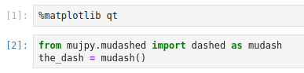
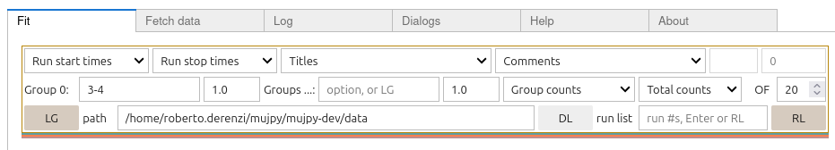
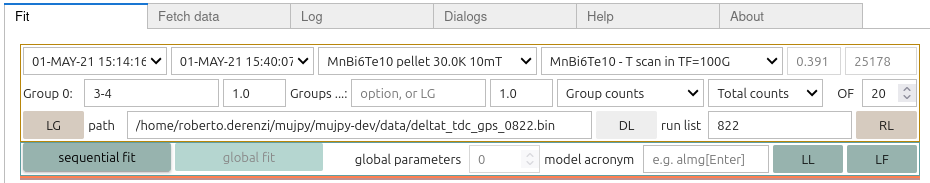
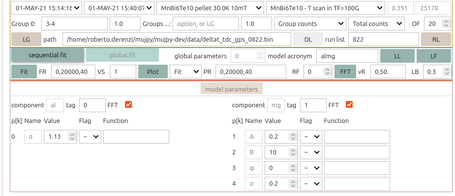
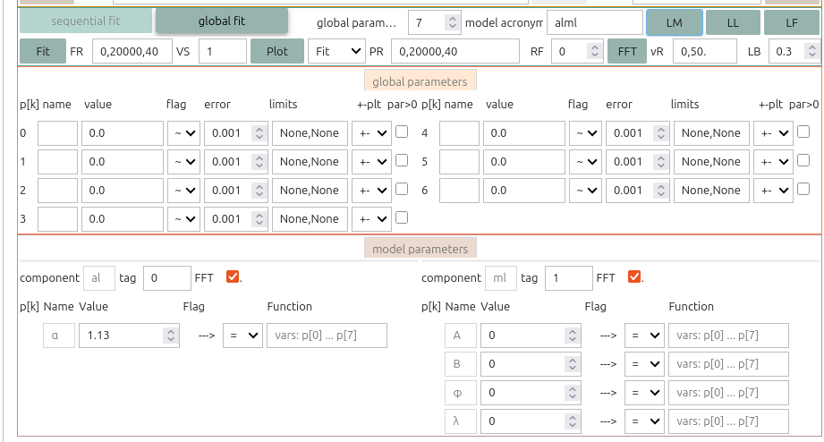
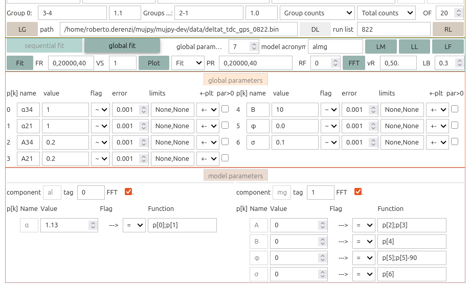

.. _reference:

+++++++++
Reference
+++++++++

This is the mujpy Reference Manual, (v. 3.1.3). It is intended as a Reference for the gui, and a more advance tutorial at the same time. The main classes first, then the advanced tutorial, additional Details at the end. Navigate by the left RTDs menu.

The main classes
----------------
See :doc:`Source Documentation <Source>` for the docstrings of each method. Any action can be lauched by a python script (see :ref:`demos`), using the following classes:

musuite
*******
.. code-block::

    from mujpy.musuite import suite
    the_suite = suite(datafile,runlist,grp_calib,offset,startuppath,**kwargs)
    autocmd BufWritePost *.rst execute '!make html'

* datafile, the path, ``str``, to a prototype data file
* runlist a list of M run numbers, ``str``; besides pure csv the shorthand allows: ``822,827:834`` and ``822,827:829:-1`` = ``822,828,828,827``. ``822+823,824`` the first two runs are added. 
* grp_calib ``[{},[]]``, N dicts, one per group, each has e.g. ``{"forward":"2,3","backward":"1,4","alpha":1.12}``
* offset ``str`` an integer
* startuppath (``str``) unused.

The class methods are described in :doc:`Source``, under ``suite`` . N groups and M runs generate multidimensional vectors of MxN asymmetries. Time `t=0` is `automatically <t = 0>`_ determined. 

mufit
*****
.. code-block::

    from mujpy.mufit import mufit
    the_fit = mufit(the_suite,dashboard,**kwargs)
    
* ``the_suite``, see `musuite`_  
* dashboard ``str`` the path to a dashbord json file, and kwargs are

  * chain = False,  chain = True to use parameter values from previous run as guess for next  
  * dash_log = None, internal parameter, used by mudashed to direct log output
  * initialize_only = False, if mufit is used just to load parameters for a guess plot 
  * grad = False, a dead branch option
  * scan = None, options are ['T','B','['], tells mufit to order csv file in increasing order of run number, temperatures, fields or angles, as extracted by `musuite`_ from the datafile headers.
chain=True,dash_log=None,no_fit=False, grad=False, scan = None, verbose = False

The class performs any fit, single asymmetry, sequential or global on several asymmetries (see `fit`_). 
Single and global fit minimize one chi square. Internally `mufit` distinguishes:

 * *A1*, single asymmetry
 * *A20*, sequential fit of N asymmetries (N groups, 1 run)
 * *A21*, global fit of N asymmetries (N groups, 1 run)
 * *B1*, sequential fit of M asymmetries (1 group, M runs)
 * *B20*, sequential fit of MxN asymmetries (N group, M runs )
 * *B21*, run sequence of M global fits of N asymmetries each (N groups)
 * *C1*, global fit of M asymmetries (1 group, M runs)
 * *C2*, global fit of MxN asymmetries (N groups, M runs)

json fit file
*************

Contains the full description of any legal fit model in a dict. Must agree with the MxN asymmetry vector provided by `musuite`. Contains  (see `fit_model`_) 
It consists of a python dict, with a few plain keys, and crucial ones containing further structure:

 *  "version": "1", a label, 
 *  "fit_range": "0,20000,40", 
 *  "offset": 20,  first good bin relative to t = 0.
 *  "globpardicts_guess": [],  optional, describes global fits and contains a dict per global parameter.
 *  "model_guess": [], the most fundamental one, contains a dictionary per model component.   
 
The only reasonable way to edit a json file is by the `mudashed`_ GUI editor in either Jupyterlab or Voilà.

mufitplot
*********
::

    from mujpy.muplotfit_ import muplotfit
    the_plot = muplotfit(plot_range,the_fit,**kwargs)
    
* plot_range described  in `fit`_, the_fit is a `mufit`_ instance, and relevant kwargs are: 

  * guess = False, if True, the plot shows the guess parameter values, to visualize how good the guess is before optimization.
  * rotating_frame_frequencyMHz = 0.0, when non-zero plots data in the rotating frame, a useful way to view high frequency precessions. 
  * fig_fit=None, at start. The figure handle is returned as the_plot.fig_fit and can be inserted here again to reuse it. 
..
 * fft_range = None, to pass the frequency range for the FFT plot
 * real=True, to produce an amplitude FFT plot
 * fig_fft=None, to pass the handle of an existing FFT figure

This class produces static single fit and animated multifit plots. The three classes above allow to run any fit if its json file is already available. The next fundamental brick is  

mudashed
********

This class provides a Jupyter gui interface to mujpy.
It is invoked from jupyter notebook (see :doc:`Tutorial <Tutorial>`). 

Below, you find a reference for its widgets.
Almost each of them has a tiptool:  additional instructions appear when hovering with the mouse over the widget. Before starting choose carefully the root dir from which you fire Jupyterlab. Download your datafiles in its subdir ``data``, where ``mudashed`` will find them. Or fetch them later.

The gui
-------

The suite interface
*******************
The input to `musuite`_ can be inserted in the gui first stage, after startup. 

* Instead of grp_calib dicts, ``Group0`` text box already proposes the first group shorthand (for Up-Down gps): ``3-4``, the next box is float alpha ``1.0``. Change as you prefer. The ``Groups ...`` box accepts another, with its alpha in the next box. If you need more, separate shorthands and alphas by a `;` character.
* Alternatively, press ``LG`` and select the standard .grp file you need.
* The ``OF`` int box contains the offset (see `musuite`_)
* If you have aleady your data, press ``DL`` to load the data prototype, which provides a file name template. You can also press the Fetch data tab and download directly into the ``data`` dir, as you would from `musruser <https://musruser.psi.ch/cgi-bin/SearchDB.cgi>`_. 
* Finally insert your run list, see again `musuite`_  or `runlist`_ for its shorthand description. Enter or ``RL`` are required to actually load. ``RL`` to reload, e.g. to implement a group change.

  * Now look at the other text widgets above: title, comment, start and stop times, max bins available, ns/bin, and counts (total and per group) have appeared. Some are dropdowns for multiple runs and groups.

But a new widget line has also appeared. If you already have a suitable json fit file, place it in subdir ``fit`` and upload it by ``LF``. If you do not, let's see the editor. You must define your model by its acronym, formed by two letter syllables, its components. So ``mg`` is a simple Gaussian damped cosine component. Place an ``al`` alpha component in front and you have the basic alpha calibration model. To explore the available syllables see the Help tab.

* Leave the toggle button on Sequential and type your acronym in the ``ML`` box. Enter activates it. Say you did chose ``almg``.

******************
A1, single run fit
******************
  

The full gui appeared in its sequential fit editor version. You have two component boxes, ``al`` in the left and ``mg`` in the right column. Each have their parameters listed below (``al`` has only one). You must now:

* Insert guess values in the third place, after index number and par name, which are fixed by the component. You could change the component label, but there is really no point. Suppose you have a TF experiment an 10 mT (remember, fields are in mT in ``mujpy``!)
* Notice the Flag, the ``~`` symbol indicates a free minuit parameter. For this model, that's fine.

  * There is a new row of widgets above the editor, the leftmost is the Fit button. Before you hit it ...
  * Check ``FR``, fit range: start, stop bins, pack factor
  * Check ``VS``, Its a label to distinguish fits, if need be.
  * You coul preliminarly plot your model selecting ``Guess`` in the dropdown and pressing ``Plot``. 
  * You can select plot range independently of fit range, 
    
     * For a ZF asymmetry with fast damped precessions and slow longitudinal decay you can select a two-contiguous-range display, e.g. ``0,500,4,20000,40``.

  * Forget the rotating frame ``RF`` and the ``FFT`` parameters for now. Press ``Fit`` instead.
  *  With no mistakes [1]_ you got a bet fit, the tab switched to Log and you get also a plot, either popup window (if you wrote ``%matplotlib qt`` in the first notebook cell) or on the right of the log, with ``%matplotlib ipympl``. Log and plot should be self evident. 

Before we leave this first fit, assume you had two components here with slightly different local fields. You could try an ``almgmg`` fit. On pressing Enter again a new editor would rebuild with three components. [2]_ Fill in the third component guesses. Most certainly the second ``mg`` must share the phase with the first. Do that by setting the second phase flag to ``=`` and fill its function with ``p[3]``, so it will use the same value as the first phase, index-3 parameter. [3]_ Parameter values can be fixed (Flag "!").

.. [1] Many (if not all) mistakes are trapped. You get an error message in the Dialog tab. When you press OK it disappears and sends you back to the Fit tab.
.. [2] This works only if you remove one or add one component. If you alter by more than one at a time ``mujpy`` offers to rebuild an empty model or to cancel the change.
.. [3] Always share with a previous parameter (never select ``=`` on parameter 3 to write ``p[7]`` in its Function: forward-sharing does not work).

*******************
A20, multigroup fit
*******************
Sequential fits of two groups are straightforward now. They use the same json file and you have it ready in your editor. You can reaload it by ``LF``, its name recall the ingredients: ``almg.822.3-4.1_A1.fit``. The name is model dor run dot group shorthand dot version underscore fit_type dot fit. Just load the second group:

* Type ``2-1`` in ``Groups ...`` or load ``gps.wep.grp`` witg ``LG``.
* Press ``RL`` to actually load the data. Check ``Group totals``, it changed.
* Press ``Fit``. Now you have two logs in the Log tab and the plot is an animation: the two asymmetries loop infinitely at 1 Hz, as in the figure below (toggle does not work here). This is a ``A20``-type fit.

.. raw:: html

   <video width="70%" autoplay loop muted playsinline>
       <source src="_static/mufitplot.mp4" type="video/mp4">
       Your browser does not suport video tags.
   </video>

*****************
B1, multirun fits
*****************
It's as easy as multigroup and you can have them both. Go back to the Fit tab, and add a new run to the ``runlist``: ``822,833`` and hit ``RL``, then ``Fit``. You now have four logs, four frames in your animation. This is a `B20`-type fit. If you remove ``2-1`` in ``Groups ...``, hit ``RL`` and ``Fit``, that's a ``B1`` fit. They are all sequential. Spend a minute on the plot.

* Main plot, standard. Try ``PR`` ``0,2000,4,20000,40``, ``Fit`` in the next dropdown and hit ``Plot``. Not useful here, but it shows you the split view.
* Residues, below. Easy so see missing fit components. Compare noise with 1 std orange line, 2 std green line.
* Top left box, stats, musrfit-style :math:`\chi^2` std limits.
* Bottom left: the :math:`\chi^2` histogram of deviations (residues). Nice, but not a better indicator than visual inspection  of the residues.

******
B2 fit
******
Trivial: just insert a second group in the ``Groups ...`` box and fire the same model.

Global fits
-----------
Still from the gui... 

*************
A21, B21 fits
*************
type-`A21`: global fit of two groups, same run. Plan it carefully. Minuit parameters are **all** global parameters, model parameters can only be mapped. For `alml`.

* we need two :math:`\alpha`, two ``A``, a single ``B``, a single phase, and a single decay (7 paremeters, instead of 10). Now, Press the lighter ``global fit`` side of the toggle button and:
* fill ``7`` in the ``NG`` integer box.
* A new editor appears above the model editor.

* choose shortish parameter names column 2, e.g. :math:`\alpha 21` (click twice to select initial Greek letters)
* type the guess value in column 3
* modify error (initial step) in column 5, if necessary
* modify limits if needed (e.g. 0,1 for a muon fraction)
* tick par>0 box in order to run a first ``minuit migrad`` with this parameter limits [0,None] and a second with limits [None,None]. For instance this grants positive values for Gaussian rates σ.

Next, use these global parameters in the model parameter functions: all global parameters must be referenced and each model parameter must have a function. [4]_

* eg. for al :math:`\alpha` write p[0];p[1] under column Function (notice that parameter indices start from 0)

  * fill all

Check the figure below for global parameters and model functions. This is an A21 ``almg`` fit (not ``alml`` as before).

* for B21 (the same done sequentially on a runlist) simply extend your runlist. Remember to press ``RL`` each time you add a run. The same model applies (the same json file).

.. [4] Three constants are also available in functions: :math:`\pi`, the muon gyromagnetic ratio, :math:`\gamma\mu`, the electron gyromagnetic ratio, :math:`\gamma e`

Details
-------

*******
runlist
*******

 * Shorthand with combination of *,:+* (only one : allowed)
 
   * ``432,433`` loads the *suite* of runs 432, 43
   * ``432:434`` loads the *suite* of runs 432, 433, 434
   * ``432,433, 435:437`` loads the *suite* of runs 432, 433, 435, 436, 437
   * ``432+433`` loads the sum of these two runs as a single run, etc.

*****
t = 0
*****
`musuite`_ automatically identifies the :math:`t_0=0` bin according to data provenance. 

* PSI bulk: the beam *prompt peak* (positrons that bypass the veto logic) is a close proxy. A rough iminuit fit, minimizes :math:`\chi^2` of auto-detectedinitial data portion, see class  ``muprompt`` in :doc:`Source`, where 

  * *prepeak*  and *postpeak*, number of bins before and after the maximum, fix the fit interval;

.. math::

 \frac {A_1} {\sqrt{2\pi\sigma}}  \exp\left[-\frac 1 2 \left(\frac{t-t_0} \sigma\right)^2\right] + A_0 +\frac {A_2} 2 \left[1+\mathrm{erf} \left(\frac{t-t_0} {\sqrt 2 \sigma}\right)\right]

* ISIS: the pulsed beam build-up of muon counts is fit, see class ``muedge`` in :doc:`Source`, modeling the integral of the beam provile convoluted with pion decays (a Mathematica analytic function, checked against data) where:
 
  + Fit parameter: :math:`D,N`, :math:`t_{00}`, width of the ISIS pulse, count rate normalizer and :math:`t=0` fractional bin; `t=0` is the edge function time :math:`t_0 = - t_{00}+0.82\tau_\pi`.
  * :math:`\tau_\mu` and :math:`\tau_\pi` are the muon and pion mean lifetimes.

.. math::

   \frac{6N}{D^3(t_m-t_p)}
   \exp\!\left[-\frac{a(t_m+t_p)}{t_mt_p}\right]
   \Bigl[
     F_-(u)\,\Theta(u-D/2)
     +F_+(u)\,\Theta(u+D/2)
   \Bigr],

where

.. math::

   u=t+t_0,\qquad a=u+\frac{D}{2},

.. math::

   P(u)=u^2-2u(t_m+t_p)
        +2\left(t_m^2+t_mt_p+t_p^2-\frac{D^2}{8}\right).

.. math::

   \begin{aligned}
   F_-(u)={}&
     -2t_m^2\left(t_m-\frac{D}{2}\right)
      \exp\!\left(\frac{a t_m+D t_p}{t_mt_p}\right) \\
   &+2t_p^2\left(t_p-\frac{D}{2}\right)
      \exp\!\left(\frac{D t_m+a t_p}{t_mt_p}\right) \\
   &+(t_m-t_p)P(u)
      \exp\!\left(\frac{a(t_m+t_p)}{t_mt_p}\right),
   \end{aligned}

.. math::

   \begin{aligned}
   F_+(u)={}&
      2t_m^2\left(t_m+\frac{D}{2}\right)
      \exp\!\left(\frac{a}{t_p}\right) \\
   &-2t_p^2\left(t_p+\frac{D}{2}\right)
      \exp\!\left(\frac{a}{t_m}\right) \\
   &-(t_m-t_p)P(u)
      \exp\!\left(\frac{a(t_m+t_p)}{t_mt_p}\right).
   \end{aligned}

Here Heaviside :math:`\Theta(x)` equals 1 for :math:`x>0`
and 0 otherwise.

.. _static:

Component list
--------------
``mujpy`` fit components. See a full list also in the gui Help tab. Adding new ones in python is straightforward (see `add components`_) 

Two-character syllables are easy to memorize. E.g. ``al`` for  :math:`\alpha` correction, ``ml`` for **m**\ uon precession with **L**\ orentzian relaxation, etc. Here is the list again:

* **al**, the ratio :math:`\alpha` betwen the initial (unpolarized) muon decay count rates, :math:`N_b` in Backward counters and  :math:`N_f` in Forward counters. 

  * ratio :math:`\alpha`

.. math:: \frac {N_b}{N_f}`,

* **bl**, Lorentz decay: 

  * asymmetry :math:`A`
  * Lorentzian rate (:math:`\mu s^{-1}`) :math:`\lambda`
    
.. math:: A\exp(-\lambda t)  

* **bg**, Gauss decay: 

  * asymmetry :math:`A`
  * Gaussian rate (:math:`\mu s^{-1}`) :math:`\sigma`

.. math:: A\exp\left(-\frac {\sigma^2 t^2} 2\right)

* **bs**, Stretched exponential decay: 
 
  * asymmetry :math:`A`
  * rate (:math:`\mu s^{-1}`) :math:`\lambda`
  * exponent beta :math:`\beta`

.. math:: A \exp \left(-(\lambda t)^\beta \right)

* **ml**, Lorentz decay cosine precession: 

  * asymmetry :math:`A`
  * field (mT) :math:`B`
  * phase (degrees) :math:`\phi`
  * Loentzian rate (:math:`\mu s^{-1}`) :math:`\lambda`

.. math:: A\cos\left(\gamma_\mu B t + \frac{2\pi}{360}\phi\right)\,\exp(-\lambda t )

* **mg**, Gauss decay cosine precession: 

  * asymmetry :math:`A`
  * field (mT) :math:`B`
  * phase (degrees) :math:`\phi`
  * Gaussian rate (:math:`\mu s^{-1}`) :math:`\sigma`
  

.. math:: A\cos\left(\gamma_\mu B t + \frac{2\pi}{360}\phi\right)\,\exp\left(-\frac {\sigma^2 t^2} 2\right)

* **ms**, Stretched exponential decay cosine precession: 

  * asymmetry :math:`A`
  * field (mT) :math:`B`
  * phase (degrees) :math:`\phi`
  * rate (:math:`\mu s^{-1}`) :math:`\Lambda`

.. math:: A\cos\left(\gamma_\mu B t +\frac{2\pi}{360}\phi\right)\,\exp \left(-(\Lambda t)^\beta \right)

* **jl**, Lorentz decay Bessel precession 

  * asymmetry :math:`A`
  * field (mT) :math:`B`
  * phase (degrees) :math:`\phi`
  * Lorentzian rate (:math:`\mu s^{-1}`) :math:`\lambda`

.. math:: A j_0 \left(\gamma_\mu B t  +\frac{2\pi}{360}\phi\right)\,\exp\left(-\lambda t \right)

* **jg**, Gauss decay Bessel precession 

  * asymmetry :math:`A`
  * field (mT) :math:`B`
  * phase (degrees) :math:`\phi`
  * Gaussian rate (:math:`\mu s^{-1}`) :math:`\sigma`

.. math:: A\cos\left(\gamma_\mu B t +\frac{2\pi}{360}\phi\right)\,\exp \left(-\frac{\sigma^2 t^2} 2 \right)

* **js**, Stretched exponential decay Bessel precession: 

  * asymmetry :math:`A`
  * field (mT) :math:`B`
  * phase (degrees) :math:`\phi`
  * rate (:math:`\mu s^{-1}`) :math:`\Lambda`

.. math:: A j_0 \left(\gamma_\mu B t +\frac{2\pi}{360}\phi\right)\,\exp \left(-(\Lambda t)^\beta \right)

* **fm**, FMuF coherent evolution: 

  * asymmetry :math:`A`
  * dipolar field (mT) :math:`B_d`
  * Lorentzian rate (:math:`\mu s^{-1}`) :math:`\lambda`

.. math::

   \begin{aligned}
   &\frac{A}{2}\,\exp(-\lambda t) \\
   &\quad \times \Bigl[
      1+\frac{1}{3}\cos\bigl(\gamma_\mu B_d\sqrt{3}\,t\bigr)
      +\left(1-\frac{1}{\sqrt{3}}\right)
       \cos\bigl(\gamma_\mu B_d(3-\sqrt{3})\,t\bigr) \\
   &\qquad
      +\left(1+\frac{1}{\sqrt{3}}\right)
       \cos\bigl(\gamma_\mu B_d(3+\sqrt{3})\,t\bigr)
   \Bigr]
   \end{aligned} 

* **kg**, Gauss Kubo-Toyabe: static and dynamic, in zero or longitudinal field by `G. Allodi Phys Scr 89, 115201 <https://arxiv.org/abs/1404.1216>`_

add components
--------------

Remember: each component [5]_ is added to the model, maybe with other components. 

First check one of them in :doc:`Source`, e.g. look for ``mumodel.ml``, display the code (press the green link [source] and spot the method at the top of the green box that opens. The python code is very simple. 

Edit ``your-venv/lib/python-3.12/site-packages/mujpy/mucomponents/mucomponents.py`` [6]_ (substitute ``your-venv`` and check the ``python-3.12`` dir). Add your new method with a novel two-letter name. Emulate the docstring and its ``func_code`` definition (ignore private ``_`` methods ending with ``ml``). Save in place. Restart the Python3 kernel in your running notebook. 

Push a new branch to github if you are happy and email the author with details.

.. [5] but for the single parameter :math:`\alpha` of ``al``, which regenerates the asymmetry
.. [6] at your own risk, you can always ``pip install --upgrade mujpy`` again if you get in a mess
.. _FFT-checkbox:

FFT checkbox
------------

[Sorry, FFT is presently missing in v3.1.2]

Selects subtracted components for the FFT. E.g. assume best fit model ``blmgmg`` with the first two components checked and the last unchecked. The FFT of Residues will show the Fast Fourier Transform of the data *minus* the model function for the first two components.  

Counter inspection
------------------

[Sorry, presently missing in v3.1.2]

* The *Counter* button produces the plot.
* The next label reminds how many are the available counters.
* The *counters* Text area allows the selection of the displayed detectors. The syntax is the same as for group. It is advisable not to display more than 16 detetcors at a time
* *bin*, text area to select *start*, *stop*, the same range for all chosen detectors.
* *run* dropdown selects one run at a time among the loaded suite.

