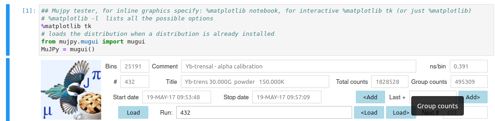
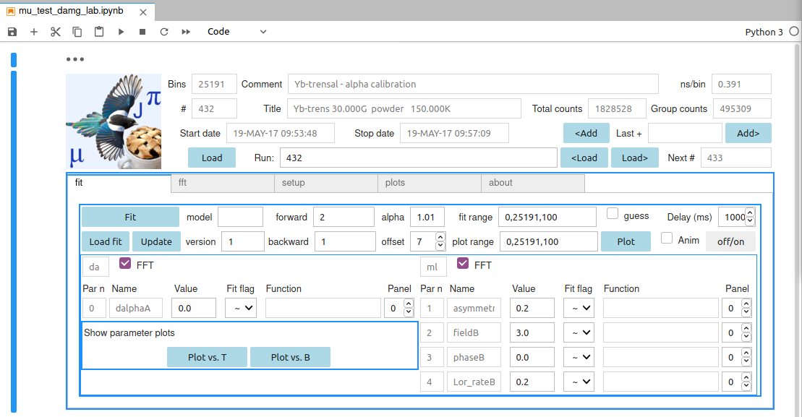

.. _Tutorial:

Tutorial
========

We will walk through a few basic steps, assuming you have installed the following bits (see :ref:`installation`)

- python
- jupyter-lab
- mujpy and its dependencies

Starting from scratch
---------------------
Navigate to the working directory of your choice
copy or link there the mugpy notebook mujpy_test_damg_lab.ipynb file

Make a data dir, a tlog dir and a log dir.
Copy or link your data files, e.g. ``deltat_tdc_gps_0432.bin``
in the first, 
and (optionally) the temperature log files in the second.
The present mujpy version reads PSI bulk MuSR (bin)  data (contributions towards reading other data formats welcome). 
Now you can launch

::

    jupiter-lab

    The location from which you launch jupyter-lab is your 
working directory (wd) and it opens in a tab of your browser.
The page has a vertical tab list on the left. Click on the first (folder) icon, a file browser column opens. Click on the mu_test_damg_lab.ipynb notebook. 
    The mujpy Graphical User Interface (MGI) notebook will open in another browser tab. You can now minimize the file browser clicking again on the folder icon.  Now a stand alone Ternimal should appear, move it at your convenience but *do not kill it*. In case, restart by hitting the play icon on the header bar of the tab. And the MGI should reappear in the tab. 

.. note::

    Jupyter-lab itself has many important features, some obvious, some less so. Practice with its toolbars, that however compete for screen space with the MGI. Choose the best layout with view. If you have 1920x1080 display you can reduce the browser to half screen, horizontally, and keep termial + graphisc in the other half

.. warning::
    Sometimes the MGI might be missing. Click on Kernel, among the top tabs, and select Restart Kernel and Run All Cells.
    If you manage to overwrite the template notebook (it happens, with the many handy buttons of Jupyter-lab: beware the scissors!!) with an empy cell. do not worry. 
  
The text of the hidden first cell is the following three-liner (of course # means the rest is a comment)::
    
    ## Mujpy tester, for inline graphics specify: %matplotlib notebook, for interactive %matplotlib tk (or just    %matplotlib)
    # %matplotlib -l  lists all the possible options
    %matplotlib tk
    # loads the distribution when a distribution is already installed 
    from mujpy.mugui import mugui
    MuJPy = mugui()
    

Cut and paste it into an empty notebook cell. Click on the left blue vertical line to toggle hide this first cell. Run it as usual 

Notice: the mujpy instance is called MuJPy in this cell (you can call it as you wish). This is important for developers who whant to check innards.

.. hlist::
    * hovering over widgets provides *baloon* tips (true also for some widgets in mujpy);
    * click on the panel on the left of the MGI: it toggles between scroll and full output (preferable for the MGI)

Setup tab
---------
This tab is for preliminary information that you revisit generally only at the start of a new experiment. 
Write the directories, either the full paths or the relative paths from the wd, 
the fileprefix, the filename before the run numbers (`deltat_tdc_gps_`),
the extension, the filename after the last dot (`bin`).
When you have correctly set these fields you may temporarily *save setup*.

When restarting mujpy next time these fields will be 
automatically loaded from the default startup file `mujpy_setup.pkl`. 

Top header
----------
Load a single run data set. Press Load and use the file selection GUI. Or write a run number, without leading zeros, e.g. `432`, in the Text widget space labelled *Run [run suite]*. Hovering over the label provides a tip for the syntax (see **Reference**). For now just load a single file. In this first example we shall produce its best fit. The file is loaded when hitting return. You may tell because the title, comments and other info appear in the header on the right of the mujpy logo.

If a *next run* number appears in the label space below the -*run [run suite]* text, it means that the corresponding file is in the data directory and you can load it by pressing *Load nxt*.

Finding :math:`t_0=0` in the data
---------------------------------
Go back to the **Setup** tab. Mujpy times are always expressed in microseconds.

.. note::
    At PSI the position of :math:`t_0=0` in the time array is fitted on the *prompt positron* peak, corresponding to positrons transported with the beam through the muon start detector, directly through a positron detector. These events ought to be vetoed by the specrtometer, but a sizeable amounts spills through and provides an intense peak at time *t=0*. Noticeably a very low background count rate is recorded before that time and a larger count rate follows the prompt. The time dependent muon asymmetry is detectable only in this second part. The fit function for identifying time :math:`t_0=0` is composed of a low plateau on the left and a high plateau on the right, joined by a Gaussian peak.  

Check that *prepeak* (end of first plateau) and *postpeak* (beginning of second plateau)  are reasonable numbers (e.g. 7 for both). Then hit *prompt fit*. You will see the bets fits for all positron detectors and the corresponding bins will be stored. You can view them clicking on the *t0 bins and remainders* Accordion.

You can now *save setup* again.

First fit: alpha determination.
-------------------------------
Go to the **Fit** tab. For an asymmetry fit you need to choose Forward and Backward detectors (the set of these two groups of detectors is called grouping). A simple syntax allows complex grouping input, e.g. 2:4,8  and 1,5:7 means that a composite Forward detector includes counters 2,3,4 and 8, whereas Backward includes 1,5,6, and 7.

.. note::
    We assume that your data set is from Dolly or GPS and you are running in longitudinal mode (Wien filter, or spin rotator, switched off) . The initial muon spin direction will be pointing almost backwards with respect to the incoming muon  momentum. The data set will be a weak transverse field experiment (WEP power supply, see the `GPS manual <https://www.psi.ch/smus/InstrumentGpsEN/User_Guide_present_version.pdf>`_), say 20 Gauss, recorded at 0.391 ns/bin. See e.g. `MuSR calibration <http://www.fis.unipr.it/~derenzi/dispense/pmwiki.php?n=MuSR.Calibrations>`_ for the definition of alpha.                              

In these conditions detector 2 is forward and detector 1 is backward. Write these two numbers in the respective Text areas.
Write a starting guess for alpha in the corresponding Text Area, say 1.0. Choose a first usable bin, typically *offset* 7 (to allow for the prompt peak to have fully decayed).  A suitable fit range is between bin 0 (corresponding now to 7 bins after the centre of the prompt peak) and 25000. For a slow muon precession a packing of 100 bins is appropriate: the time interval bewteen rebinned points corresponds to 39.1 ns, adequate for the expected ca 3 MHz Larmor frequency. This is written as 0,25000,100 in the *fit range* Text area (the meaning is *start,stop [,pack]*, as the tip shows).

The default model is suited for alpha calibration. Its layout is shown below

It is called *daml*. Write this acronym in the *loadmodel* area if you want to produce it from scratch. The model rationale is the following:

* each model is composed of components (see the :ref:`static`); this model is composed of *da* and *ml* 

 * the second, *ml*, is a Lorenztian (*l*) damped cosine component (for historical reasons *m*, for mu); 
 * the first, *da* for delta alpha, is a linear approximation to the correction for an alpha different from the guess value (1.01 here);

* to determine the field dependent best value of alpha *subtract* dalpha from alpha, write the result in the corresponding Text area and iterate (since the function is a linear correction it works well for small displacementes dalpha); a better strategy is described in the :ref:`examples`
* their parameters are listed il the lower frame, each indentified by an index, a unique name, a Text area for the starting guess value, a symbol:

 - *~*  free minuit parameter, 
 - *!*  fixed parameter 
 - *=*  the function text area on the right is activated. You can input symple expressions, such as ``p[1]``, implying that the present parameter and parameter 1 share the same value. For instance two *ml* components in model *damlml* could share their phase parameters.

* parameter names are automatically generated and pretty obvious if you are not new to MuSR. E.g. *ml* has a (partial) *asymmetry*, a *field* value (in Tesla), a *phase* (in degrees) and a Lorentzian relaxation *Lor_rate* (in inverse microseconds); 
* names are followed by a capital letter that uniquely identifies each component (e.g. in a *blmlml* fit the asymmetries of the three components would be *asymmetryA*, *asymmetryB*, *asymmetryC*, respectively) 

When you are happy with the initial guess hit the *Fit* button. You may preview your initial guess by pressing *Plot* to check that it is not too far off. Notice that *plot range* is more complicated: legal ranges are

* 0,20000 (implying no packing)
* 0,20000,100 (same meaning as for *fit range*)
* 0,2000,20,25000,100 (plots two contiguous ranges, the first is 0,2000,20, the second is 2000,25000,100)

The best fit minuit printout is shown the output tab, it is automatically plotted Results are saved in two files: 

* a csv file suited for qtiplot/opj manipulation, that is automatically updated at each new fit of the same model and grouping; 
* an individual file  for each run

Versions can distinguish fits with the same model and grouping (e.g. distinguished by different parameter functions)

The file is a binary pickle of the dill variety. To read it in python

::

    import dill as pickle
    with open(filepath,'rb') as f:
        pickle.load(f)

and you will find all fit parameters in dictionary fitarg. 

 
