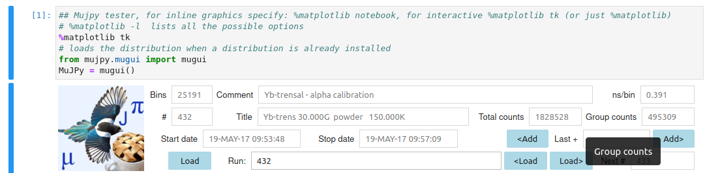

.. _Tutorial:

Tutorial
========

Automatic tests
---------------
Run 

.. code::

       python -m mujpy.tests.tests
  
in a terminal. The tests automatically produce 16 distinct types of `mujpy` fits on a standard gps TF experiment. The model chosen here is the sum of two relaxing cosines, a Gaussian component, `mg`, and a Lorentzian component `ml`, identified by the model acronym: `mgml`.  Follow below to understand their features:

* A plot opened: you see a TF asymmetry with its fit. Check the note below, and kill the window when done.

.. note::

        This is a simple A0 fit .Additional helpers catch goodness of fit: the residues, lower panel, an info box, top right, and :math:`\chi^2` histogram of the fit standard deviations, with the expectation curve, bottom right. More details in the terminal output. All the information is stored in log (ASCII), csv and json format, for plotting and reproducibility. When you kill the plot you also get a test summary.

* Another plot opened: same scenario, the A20 fit. Two orthogonal groups of detectors have been independently fitted. The log reports two reduced :math:`\chi^2` values.
 
.. note::
        This is an animation: you see both fits, in an infinite loop. Click on the plot to toggle stop/start. The terminal shows two compact logs (replicated in subfolder `cache/`): uniquely named parameters and their best values are also added to a specific csv (subfolder `csv/`). More details elsewhere in these docs.

* B1 fit: 4 independent A1 fits on a list of runs. Approaching a phase transition below 12.0 K

.. note::
        The animation loops on four independent fits. Actually the :math:`\chi^2` is not very good at 12.0K, something else is going on...

* B20 fit: 8 independent A20 fits on the same list of runs. Discover in which order from the plot and check on the log.
* A21 global fit: same run and groups as A20, but a single cost function. Log lists the best values of the Minuit parameters (f,A34,A21 etc) before the usual componet parameters, derived from them (here, a few details are hidden ...).
* B21 global fits: 4 independent A21 fits for the list of runs. Check.
* C1 global fit: list of 4 runs, only one group. Check that there is a single reduced :math:`\chi^2` and list of Minuit parameters. The log shows also the components for each asymmetry (for each run).

.. note::
        Each frame of the animation reports estimated :math:`\chi^2` statistics for that asymmetry, in the info box. The only true reduced :math:`\chi^2` is in the log.

* C2 global fit, the full Monthy. A single cost funtion for 2 groups and 4 runs. 

But there are further 8 fits. The previous ones had fixed :math:`\alpha` ratios (calibrated somehow). The next ones, model `almgml`, include :math:`\alpha` as a fit parameter for each group, in the very same sequence. Component `al` is listed with the others but it's not additive, it's treated differently.  That's `some`\ how the :math:`\alpha` is calibrated, and you can calibrate a single value for many runs, with C1, C2 fits (if you trust that the value remains the same). 

Now you can also re-run each test on its own. List them pasting 

.. code::

        python -c "from mujpy.tests.tests import ParameterizedRunner as PR; rnr=PR(); rnr.list_tests()"
        
in the terminal. Execute e.g. test 0 (A1 almgml) by 

.. code::

        python -c "from mujpy.tests.tests import ParameterizedRunner as PR; rnr=PR(); rnr.test_single(index=0)"

Coming demos will show how to get these fits with the GUI, in jupyterlab or, more simply, with voila.

.. note::
        the test timings includes your watch time on the plot! Not very significant.

old v2.0 instructions
---------------------

.. warning::
    **Ignore**
    Space for new demos.
  
The text of the hidden first cell::
    
    ## code comment

Cut and paste it into an empty notebook cell. Click on the left blue vertical line to toggle hide this first cell. Run it as usual 

Old figure.

.. hlist::
    * hovering over widgets often provides tips;
    * click on the panel on the left of the GUI: it toggles between scroll and full output (preferable for the GUI)

